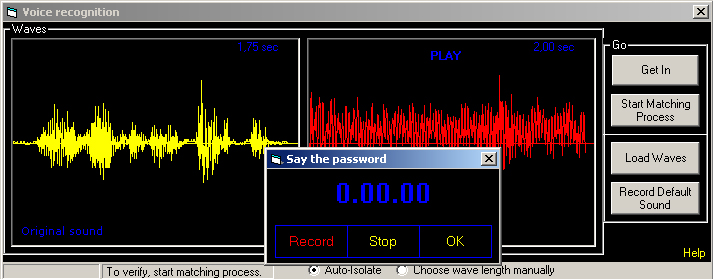

## Voice Recognition \- UPDATED: Instant Voice Access

### Description

A voice recognition/identification system, where 2 waves are compared, in order to find the matching percentage. NO external engines! I wanted to copy spy movies, where one had to SAY the password to get in. It can be easily integrated in your programs, as a password substituter.
 
### More Info
 

             |
---                |---
**Submitted On**   |2005-10-19 22:31:12
**By**             |[Licar Bogdan](https://github.com/Planet-Source-Code/PSCIndex/blob/master/ByAuthor/licar-bogdan.md)
**Level**          |Intermediate
**User Rating**    |4.8 (86 globes from 18 users)
**Compatibility**  |VB 5\.0, VB 6\.0
**Category**       |[Sound/MP3](https://github.com/Planet-Source-Code/PSCIndex/blob/master/ByCategory/sound-mp3__1-45.md)
**World**          |[Visual Basic](https://github.com/Planet-Source-Code/PSCIndex/blob/master/ByWorld/visual-basic.md)
**Archive File**   |[Voice\_Reco19418110202005\.zip](https://github.com/Planet-Source-Code/licar-bogdan-voice-recognition-updated-instant-voice-access__1-62860/archive/master.zip)

